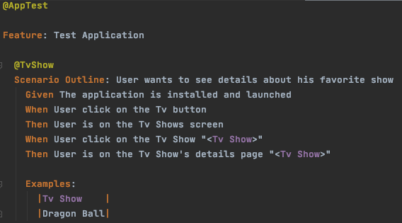
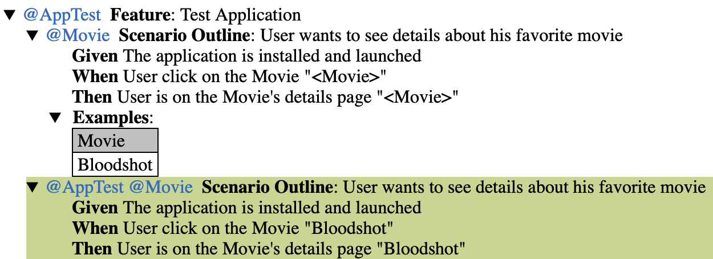
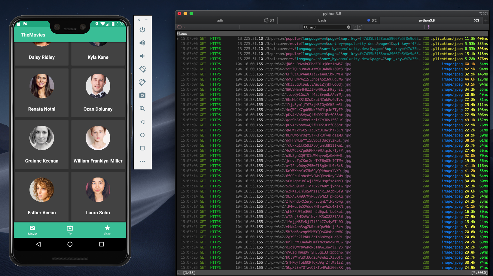
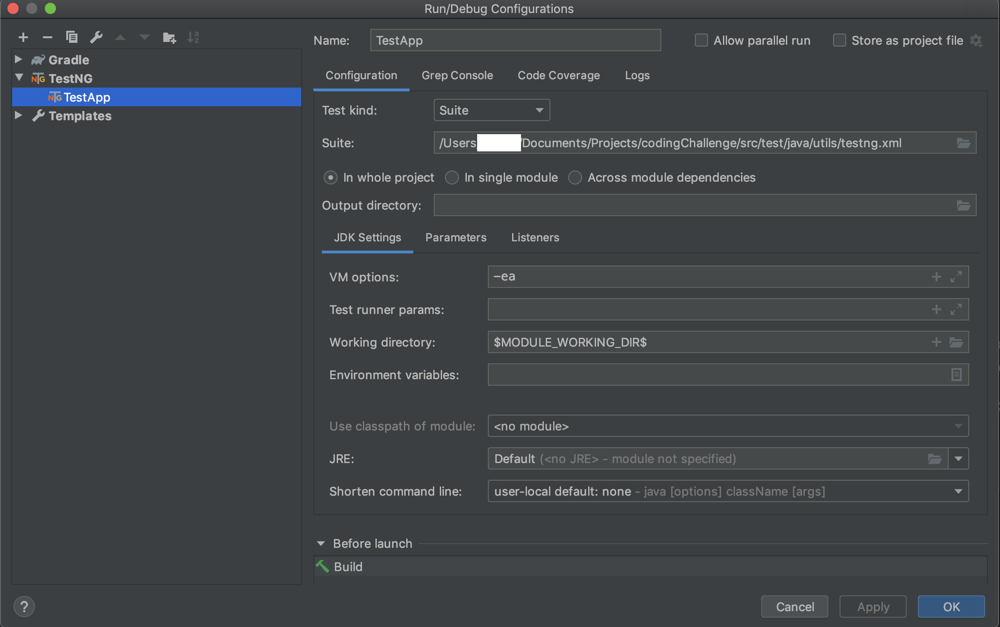

# QA Engineer Coding Challenge

## 1. Topic
### 1.1. Goal
To be able to run automated test on an independant IMDB application.

Plus, do some network traffic check.
### 1.2. Chosen solution
Will be used :
   - Java
   - Gradle
   - TestNG
   - Cucumber
   - Appium
   
## 2. Prerequisites 

### 2.1. Environment (to be installed)
- gradle 6 (or above) (code isn't compatible with older versions)
- Java
- Node
- Appium
- mitmproxy

### 2.2. Other Tools 
- Intellij IDEA (CE is enough) 

Note: Intellij IDEA include both Cucumber and TestNG support.

## 3. Solution

### 3.1. Cucumber Test using Java

#### 3.1.1. Test Cases

the tests are to be found in 
>src/test/resources/gradle.cucumber

They look like :

#### 3.1.2. Runner

Using TestNG runner, with cucumber options.
The called xml file is 
>src/test/java/utils/testng.xml

#### 3.1.3. Reports

Using basic cucumber reporting (pretty-html could be used, but not relevant here)

#### 3.1.4. Devices

This code can run on either AVD or real device.
Note that network tests will be done on AVD only.

#### 3.1.5. Chosen Application

Application build from project https://github.com/skydoves/TheMovies

#### 3.1.6. Network overview

using mitmproxy we can check all the call made by our test..

### 3.2. Pre-launch

open 2 terminal:
- 1st one:
> appium
- 2nd one:
> mitmproxy

Open your AVD or connect your real device.

### 3.3. Launch tests

#### 3.3.1. CLI
> gradle test

#### 3.3.2. IDE

#### 3.3.2. test network velocity
there is a capabilit that allow to set the networkspeed.
> capabilities.setCapability("networkSpeed", "lte");

The networkSpeed desired capability will change the upload and download speed accessible to the emulator. The following values can be set, all speeds are in kbps:

- gsm - GSM/CSD (up: 14.4, down: 14.4).
- scsd - HSCSD (up: 14.4, down: 57.6).
- gprs - GPRS (up: 28.8, down: 57.6).
- edge - EDGE/EGPRS (up: 473.6, down: 473.6).
- umts - UMTS/3G (up: 384.0, down: 384.0).
- hsdpa - HSDPA (up: 5760.0, down: 13,980.0).
- lte - LTE (up: 58,000, down: 173,000).
- evdo - EVDO (up: 75,000, down: 280,000).
- full - No limit, the default (up: 0.0, down: 0.0).

then check responses time in mitmproxy

## 4. Ideas

### 4.1. AVD - proxy

we could check, for each interraction, if the proxy response is 200.
If not, analyse the response.
If yes, continue the test.

That way we could manage to check on real time if there is a issue with the testing environment (API/Backend) or 
the application itself whenever an error occurs on the application.

### 4.2. Fully automated process

the following processes can be easily automated (included in the code as part of the testing process):

 - Appium server
 - mitmproxy 
 - AVD (emulator)
 
That way we can reduce the time of precondition for launching the test.
#### BUT
We loose access to real time log in command prompt.

open them in a new prompt is do-able, but tricky, we can also save each log in files...

I chose not to do so in order to show the knowledge about the architecture.

### 4.3 Standalone package

in order to render the code run-able on everyone's computer, Appium and gradle can be made portable

## NOTES

filtering movies based on year or popularity wasn't possible for any of the 3 android applications.
But we can see trough the proxy that the API allows such things...

