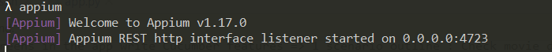
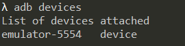
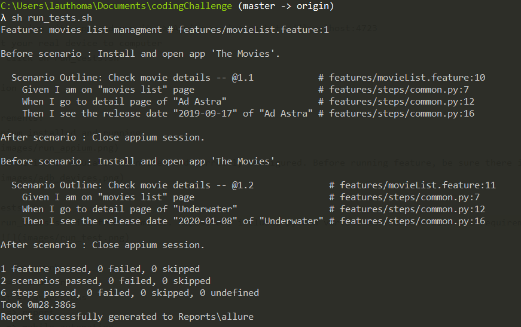
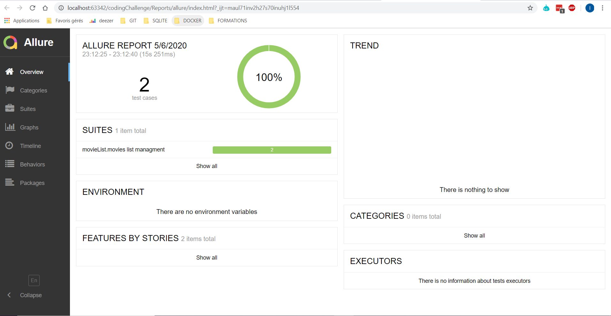
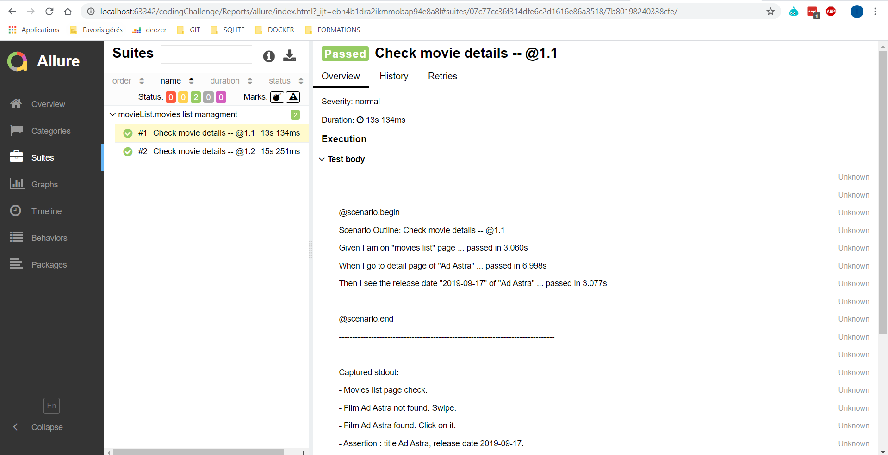
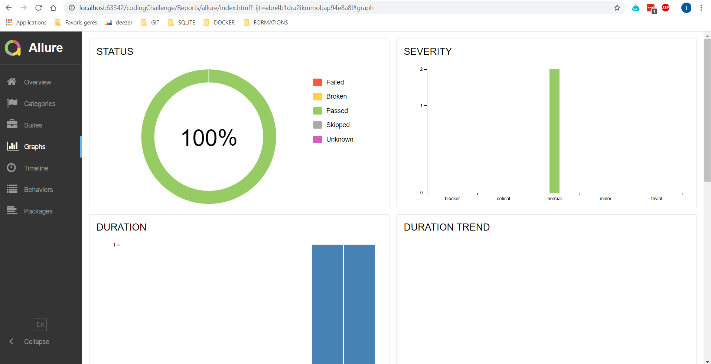

# QA Engineer Coding Challenge

Hello there and welcome to our coding challenge. Buckel up and enjoy the ride. 

## Rules
Before we start there are some rules of engagement:
1. Submissions must be formulated as GitHub merge requests
2. You can make smaller commits and MRs so that we can see the gradual progress
3. Please respect the given deadline

## Setup before starting
- create a GitHub Account if not having one already
- create a TMDB account https://www.themoviedb.org/documentation/api
- use a proxy tool, e.g. https://mitmproxy.org

## The Challenge

The challenge consits in:
1. Choose one of an already existing Android or iOS TMDB client Apps from these:

https://github.com/skydoves/TheMovies

https://github.com/alfianlosari/MovieInfoMVVMiOS

https://github.com/haroldadmin/MovieDB

https://github.com/IhwanID/belajar-android-jetpack-pro

2. Write automation tests based on the sample project you chose. Automations tests should include:
- going from main movies list screen to the details screen of the app => 1 scenario outline : Check movie details (features folder)
- filtering movies based on year or popularity

3. Cucumber UI features:
- based on the screens in the app write Cucumber features

4. Network tests => Not possible on real device which need to be root
- use one of the tracing tools to trace the app network traffic
- simulate network velocity

## Technical solution

I chose python to implement feature on The movies app. I had to use few python library in order to automate Android UI:
- behave => cucumber implementation
- hamcrest => test assertions
- allure => genrate html report
- appium => mobile automation framework
- selenium webdriver => wait, expected conditions

Project structure:
- app : application file
- features : features files, steps defintions, environment variables
- pages : possible actions on each pages
- Reports : behave output, allure reports
- resources : locators values
- venv : Python virtual environment
- behave.ini : behave configuration
- requirements.txt : python requirements for local installation
- run_tests.sh : shell script to execute script and generate report

## Run tests

1. Requirements:
    - appium installed and running at http://localhost:4723

    

    - real device or emulator connected and correctly configured. Before running feature, be sure there is only one
    device (virtual or real) connected to your computer with adb.

    
    
2. Run tests
    Run run_tests.sh file from terminal. Repository includes python virtual environment with all requirements.

    

    This script execute 2 tasks:
    - behave task is used to execute cucumber features and generates output file
    - allure task is used to generate prettier html reports

3. Consult tests report
    Open Reports\allure\index.html in your browser and navigate
    
    
    

## Findings & faced issues

- emulator network no internet issue :
    - add "C:\Users\lauthoma\AppData\Local\Android\Sdk\emulator" to path variable
    - restart windows session
    - run emulator with dns-server option : emulator.exe @Pixel_3_android_8.1 -dns-server 8.8.8.8
